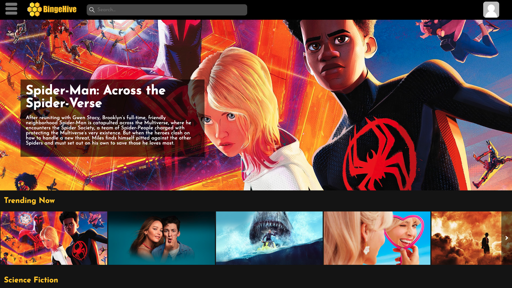

<div align="center">
  

BingeHive, a dynamic and user-friendly web app designed to be your go-to destination for all things movies and TV shows.  
_A movie or TV show aficionado's heaven._
</div>


## Usage Guide

BingeHive is currently live at [here](https://bingehive.com). To get started, simply visit the site and explore around 
for different movies or TV shows that are available. If you already know what you are looking for, 
there is also a search bar to quickly jump to search for a title.



## Technology Stack

* **Frontend**
  * HTML, CSS, and JavaScript
* **Backend**
  * Node.js - Runtime environment for server-side JavaScript
  * Express - Used for building RESTful APIs and handling routes
  * Nginx - Used as a reverse proxy to reach the Node environment running the web app
  * MySQL - Used for storing and managing user generated data
* **Authentication**
  * Express Session - Used for user authentication and authorization
  * Bcrypt - For hashing and salting the user passwords
* **Hosting/Deployment**
  * AWS EC2 - Used for deploying the MySQL database and hosting the web app
  * AWS S3 - Used for storing users' profile pictures
  * Docker - Used for quickly deploying in a containerized environment
* **Version Control**
  * Git - Used for tracking changes in the codebase
  * Repl - Used for tracking and deploying a testing environment
* **Other Tools**
  * MySQLWorkbench - Used to build the database schema
  * IntelliJ - Used to collaborate with others in real time
  * SSH - Used for server administration
* **External APIs**
  * [YouTube IFrame Player](https://developers.google.com/youtube/iframe_api_reference) - Used to fetch movie and tv show trailers
  * [TMDB](https://developer.themoviedb.org/reference/intro/getting-started) - Used to fetch information on movies and tv shows (e.g., titles and descriptions)
* **Additional Dependencies**
  * Multer - Used for profile picture file uploading from the user
  * Tingle - Used for modals
  * Cropper - Used for cropping user seleted images client side

## Explore the Code

You can explore BingeHive's code base by navigating to the `src`
directory found in this GitHub repository. Alternatively, you can simply click this [link](https://github.com/sevenwhiteclouds/bingehive/tree/master/src)
to take you there directly.

```javascript
const express = require("express");
const app = express();

app.get("/", (req, res) => {
  res.send("Welcome to BingeHive");
});

app.listen(3000, () => {
  console.log("Server started!");
});
```

## Future Plans

Currently, the generated lists can only be seen by the user that owns them. Future iterations of this
web app would allow ideally to share those lists with friends and family, 
to create a social aspect to the web app.

## Acknowledgments/Contact

Feel free to reach out to the team members who contributed to this project. 
We'd be happy to answer any questions or provide further information.

* Keldin M. - [LinkedIn](https://www.linkedin.com/in/keldinm/) [GitHub](https://github.com/sevenwhiteclouds/)
* Stacy K. - [LinkedIn](https://www.linkedin.com/in/stacy-kirchner/) [GitHub](https://github.com/puff82922/)
* Steven C. - [LinkedIn](https://www.linkedin.com/in/caseysteven) [GitHub](https://github.com/smcaseycode)
